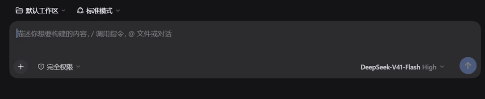
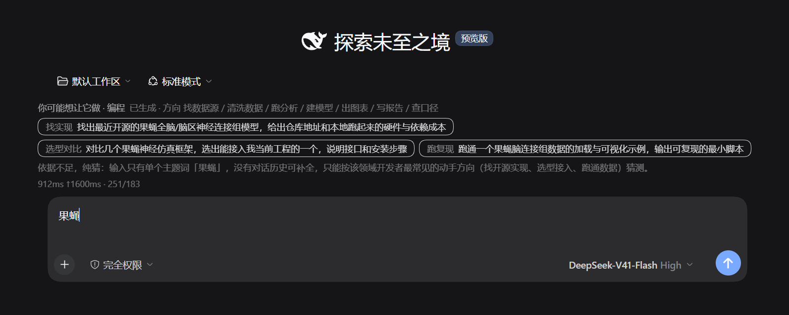

# dsh-intent-suggest

这是 [DeepSeek Harness](https://github.com/deepseek-ai/deepseek-harness)（下面简称 dsh）的一个插件。它替你思考还没打出来的那半句：你刚敲了几个字，它已经在想你要让 agent 干什么，给出三条候选任务。三条方向各不相同，每一条都能直接发。

从你停笔算起，第一条候选 600 ms～1000 ms 上屏，三条全部出来 1.5 秒以内。下面两张是本机真实跑出来的画面，输入框里分别只打了 mamba 和“果蝇”。





点一下候选，这句话就填回输入框。**发送键还是你自己按**，插件不会替你发。

## 它不太花 token

停笔 0.55 秒才发一次请求。你还在敲字的时候它不动，同一句话也不会重复发。

一次大约 200 个～800 个输入 token、150 个～200 个输出 token，差不多是一句话的长度。

不需要猜的时候它不发请求。输入是纯标点、乱码，或者你已经把任务写完整了，它就什么都不显示。

自定义画像只生成一次。你写一句“自己是干什么的”，它生成一套提示词存进浏览器，以后每次都用这套。改一句话才重新生成一次。

## 安装

```bash
dsh plugin --profile web add github:linzimu666/dsh-intent-suggest
```

重启 dsh 就生效。这条命令把参数转发给 profile 目录里的 pnpm，用的是你机器上的 pnpm；装完包名会自动写进这一档 profile 的 `dsh.profile.bundles`。手上没有 pnpm 就用 Web 侧边栏的 Plugins 页装，那条路走 dsh 自带的包管理器。

## 使用

输入框上方会出现一行“你可能想让它做 · 编程”，后面跟着候选。点这行标签可以换一档，也就是换它对“你是谁”的假设。

- 编程：候选是改代码、跑测试和定位文件这类任务。
- 调研：候选是检索论文、找数据集和复现开源实现。
- 自定义：弹出一个输入框，写一句“你是谁、平时让 agent 干什么”，它照这句话现生成一套提示词和方向表。

选择存在浏览器里，下次打开还是这一档。

## 实现细节

这一节讲它怎么做到的，只想用的话可以跳过。

### 五条需求和对应代码

| 需求 | 做法 | 位置 |
| --- | --- | --- |
| 边输入边更新 | 订阅 composer 的 `draft`，停笔 550 ms 触发。请求排队串行，不会攒出一串并发 | `client.src.js` |
| 猜意图，不续写 | 提示词要求三条方向互不相同，方向标签参与去重 | `engine/prompt.js` |
| 利用对话上下文 | 宿主用 `Session.deriveMessages()` 取最近 6 轮喂进去，指代由提示词还原 | `lib/index.js` |
| 显示要稳定 | 候选按槽位编号渲染，语义没变的留在原位。与最新输入矛盾的候选直接丢弃。旧候选降到 0.45 亮度，不会消失再出现 | `engine/stability.js` |
| 决定权在用户 | 只调 `inputActions.setDraft()`，从不调 `submit()` | `client.src.js` |

### 流式与延迟

宿主把 `text-delta` 转成 SSE（Server-Sent Events，服务器推送事件）。客户端对半截 JSON 做花括号配对扫描，第一条候选不用等全文到齐就能上屏。

实测用的模型是 DeepSeek V41 Flash，思考关闭。首条候选 600 ms～1000 ms，三条全部上屏 1.0 秒～1.5 秒。延迟大头在 550 ms 的停笔判定上，模型响应只占一小部分。

### 开发

```bash
npm test          # = node build.js && node --test test/engine.test.js
```

改代码时另开一档自己的 profile，把仓库 link 进去，别动日常用的那档：

```bash
dsh --profile web-intent --from-default-profile web   # 建档并起一次服务，Ctrl-C 停掉即可
dsh plugin --profile web-intent add link:"$(pwd)"
```

`engine/` 是不依赖框架的 ESM（ECMAScript Module，JS 模块），可以直接在 Node 里跑测试。`build.js` 把四个 engine 文件内联进 `client.js`。dsh 只服务 `<pkg>/client.js` 这一个文件，浏览器没有第二个可 import 的入口，所以生成产物一起提交。

改 `client.src.js` 或 `engine/`：跑 `npm run build`，刷新浏览器就生效。

改 `lib/index.js`（宿主侧）：要重启 dsh，重启会换一个新的 token URL。

### 画像与去重

自定义画像的方向表是模型现造的，所以 `parseItem` 按当前画像的方向列表校验标签。不在表里的方向会归一成“选型对比”，同一个方向只留第一条。少了这一步校验，三条候选会被压成两条。

### 凭据与网络

插件不配 API key。宿主侧用 `ctx.llm.stream()` 复用 dsh 自己注册的 provider 和凭据。

宿主额外开三个同源 HTTP 接口：`/intent-suggest/suggest`、`/intent-suggest/context`、`/intent-suggest/providers`。请求要过 `Sec-Fetch-Site` 和 `Origin` 的跨源拦截。`/providers` 是调试口，只列 provider 和模型 id，不输出密钥。这三个口只挡跨源、不鉴权，所以不要把 dsh 的端口反向代理到公网。

## 许可

MIT
